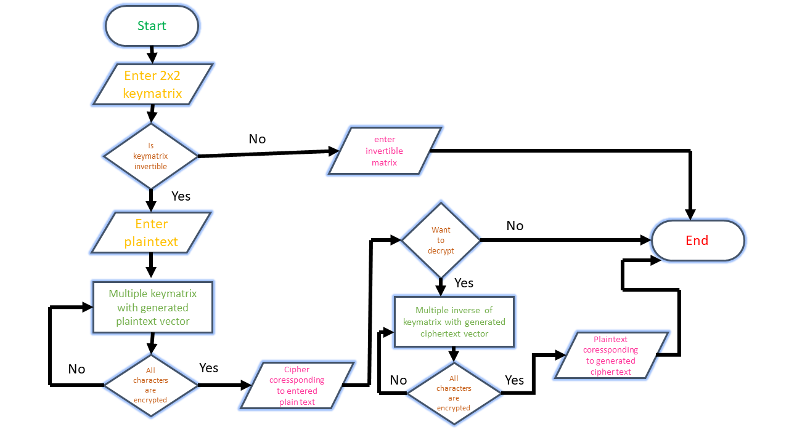
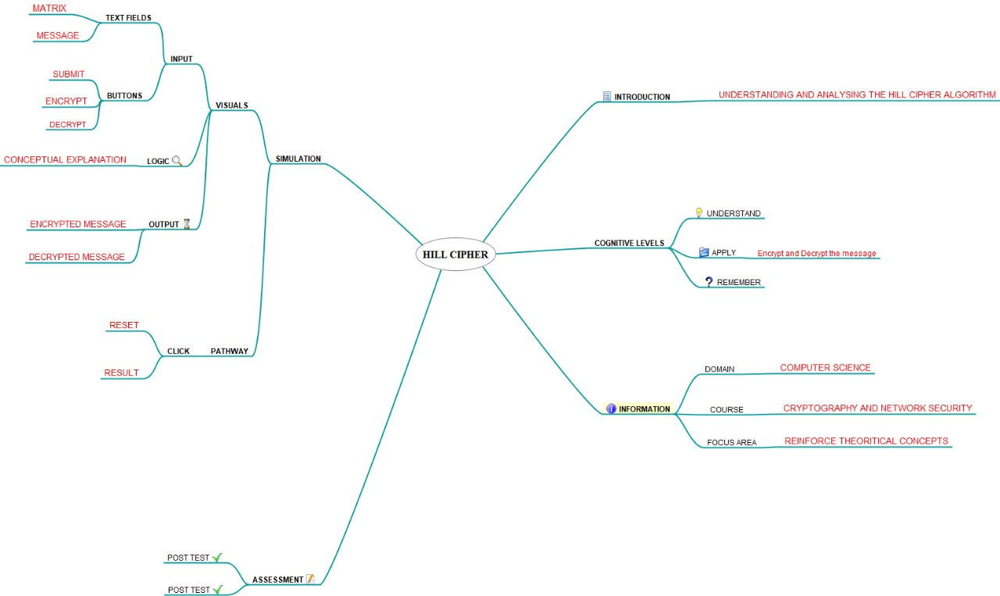
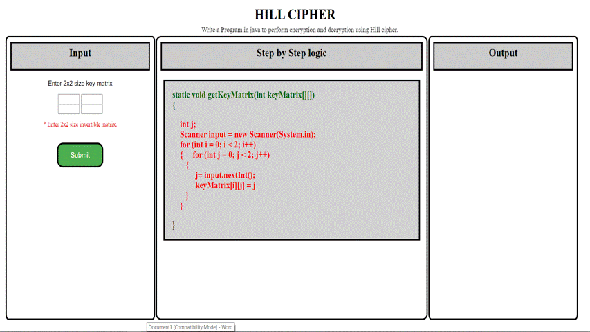

## Storyboard (Round 2)

Experiment 2: Write a Java Program to perform Encryption and decryption using Hill Cipher.

### 1. Story Outline:

The experiment is based on the concept of encryption and decryption using hill cipher, implemented through java.Student approaches the simulator in order to understand the implementation of hill cipher.Hill cipher is a polygraphic substitution cipher based on linear algebra.Each letter is represented by a number modulo 26.To encrypt a message, each block of n letters (considered as an n-component vector) is multiplied by an invertible n × n matrix, against modulus 26. To decrypt the message, each block is multiplied by the inverse of the matrix used for encryption.Student interacts with the simulator by providing key matrix and plaintext. Simulator will provide not only cipher text of corresponding plaintext and vice-versa but also helps the student to understand the implementation of hill cipher by providing the logical explanation of the output i.e. how the cipher text and plain text is being calculated.

### 2. Story:

Hill cipher is a polygraphic substitution cipher based on linear algebra.Each letter is represented by a number modulo 26. Often the simple scheme A = 0, B = 1, …, Z = 25 is used, but this is not an essential feature of the cipher. To encrypt a message, each block of n letters (considered as an n-component vector) is multiplied by an invertible n × n matrix, against modulus 26. To decrypt the message, each block is multiplied by the inverse of the matrix used for encryption.The matrix used for encryption is the cipher key, and it should be chosen randomly from the set of invertible n × n matrices (modulo 26).In order to decrypt, we turn the ciphertext back into a vector, then simply multiply by the inverse matrix of the key matrix.

Two complications exist in picking the encrypting matrix:
1)Not all matrices have an inverse (see invertible matrix). The matrix will have an inverse if and only if its determinant is not zero.
2)The determinant of the encrypting matrix must not have any common factors with the modular base.

#### 2.1 Set the Visual Stage Description:

We divide our whole simulator page into three pane.First pane will be used by the user to give input on the basis of which program executes. 
In the second pane user observes the code snippet which provide the logical expalination of the code. This pane also helps the student to understand the implementation of hill cipher by providing the logical explanation of the output i.e. how the cipher text corresponding to plaintext is being calculated and how decryption of cipher is formed using hill cipher. 
When the logical explanation will be completed the cipher text corresponding to plaintext and plaintext corresponding to cipher text will be displayed in the last pane i.e third pane. 

#### 2.2 Set User Objectives & Goals:

1)The prime objective of the experiment is to demonstrate hill cipher in java and how it allows us to perform encryption and decryption. 
2)The simulator allows the user to input the desired key matrix and plaintext and based on the input it performs encryption and decryption. 
3)To explain how encryption and decryption works and how key matrix,plain text and cipher text are used to perform encryption and decryption. 
4)To observe the output shown by the simulator when the provide inputs. 
5)To answer the assessment questions based on the observations. 

#### 2.3 Set the Pathway Activities:
1)User has to provide the key matrix in the text box provided in the first pane of the simulator. 
2)Click on the “Submit” button. It takes you to second form in which you have to enter plaintext.  
3)Click on “ Submit“ button.Then two "Next" and "Reset"buttons appears in the first pane. 
4)Click on “next “button. It provides the logical explanation of the output i.e. how the cipher text coressponding to entered plain text is being calculated. 
5)Click on “Next” button. The cipher text is displayed as output in the third pane, with the end of logical explanation of encryption.   
6)Click on “Next” button.Two "Yes" and "No" buttons appears in the first pane from where user has to chosse whether he want to go for decryption or not. 
7)If user click on "Yes".It provides the plain text corresponding to generated cipher text with the end of logical explaination of decryption and user can use “Reset” button to demonstrate hill cipher for another inputs. 
8) If user click on "No"."Reset" button will appear in the the first pane which can be used by the user to demonstrate hill cipher for another inputs. 
9)User can use “Reset” button to demonstrate hill cipher for another inputs . 

##### 2.4 Set Challenges and Questions/Complexity/Variations in Questions:
Q. Hill cipher requires prerequisite knowledge of? 
a) integration 
b) differentiation 
<b>c) matrix algebra</b> 
d) differential equation  

Q. Hill cipher is an example of ____________ 
a) mono-alphabetic cipher 
<b>b) substitution cipher</b> 
c) transposition cipher 
d) additive cipher  

Q. Encryption in hill cipher is done using ______________ 
<b>a) matrix multiplication</b> 
b) a 5×5 table 
c) vigenere table 
d) matrix inversion  

Q. What is poly graphic substitution cipher? 
a) a substitution based cipher which uses multiple substitutions at different positions 
b) a substitution based cipher which uses fixed substitution over entire plain text 
<b>c) a substitution based cipher in which substitution is performed over a block of letters</b> 
d) a transposition based cipher which uses fixed substitution over entire plain text.  

Q. A key matrix used for encryption in hill cipher must be? 
<b>a) invertible matrix</b> 
b) non invertible matrix 
c) square matrix 
d) rectangular matrix 

##### 2.5 Allow pitfalls:
1)The simulator will be able to clear the misconception about the working of hill cipher. 
2)Student may expect different outputs on the different data-type inputs (for eg 5 & 5.0). The students will not get the required outcome. 
3)The students will get an opportunity for trying different things with the simulator with an empty parameter input box. 

##### 2.6 Conclusion:
1)Assessment/evaluation of the pre-test and post-test should be given immediately to the user. The moment the student clicks on the answer of his choice, the CORRECT ANSWER should be displayed below the question. This would enable the student to understand whether he is right or wrong. 
2)This would prompt the users as to how many answers were correctly answered. 
3)Marks maybe assigned to each question which would enable the student to calculate his performance. 

##### 2.7 Equations/formulas: NA
1)C=KxP mod 26 
2)P=K-1 x C mod 26

### 3. Flowchart 4
  

### 4. Mindmap:
 

### 5. Storyboard :

